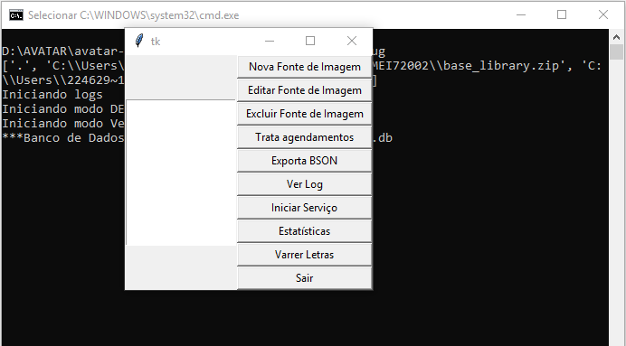
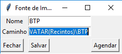
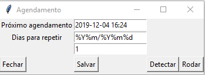

# Concepção

    Instalar e configurar o Avatar para executar o serviço de varredura de imagens dos containers. 
 
# Execução
A) Descompactar o arquivo Avatar.zip no computador no qual os Recintos enviam as imagens dos containers.

   obs: se houver mais de um computador, tem que descompactar o Avatar em cada um deles.
   
B) No arquivo 'avatar.conf', editar o campo UNIDADE com a sigla da respectiva unidade, ex. ALFSTS, ALFITJ, etc.

C) Em seguida, executar o arquivo 'avatar_run.bat'. 
Este arquivo irá criar um banco de dados local (avatar.db) e o arquivo de log (avatar.log) no mesmo diretório onde foi descompactado o .zip.
   
   Será aberta a tela do Avatar e uma tela preta de log.

D) Para cadastrar uma fonte de imagem clicar em 'Nova Fonte de Imagem'.
    
    Em 'Nome' colocar o nome ou abreviatura do Recinto e 
    em 'Caminho', preencher com o endereço raíz do diretório onde estão armazenadas as imagens.
    No exemplo abaixo, seria até o '..\BTP' e clique em 'Agendar'.
    
    Exemplo: Caminho: "D:\AVATAR\avatar-santos\AVATAR(Recintos)\BTP'
    
    Sendo que nesse exemplo, a estrutura de pastas, até o .XML e o .JPG nesse exemplo é: 'D:\AVATAR\avatar-santos\AVATAR(Recintos)\BTP\201907\20190701\' 

    
E) Após clicar em Agendar, será aberta uma nova tela. Nessa tela, preencher:

    Próximo Agendamento: "ano-mês-dia hora:minuto" ex. 2019-12-04 00:01
    (trata-se do dia inicial de captura de imagens)
        
    Dias para repetir: aqui é aplicado uma máscara que corresponde a estrutura das pastas. Pode-se usar o botão 'Detectar'.
    No exemplo anterior (D:\..\BTP\201907\20190701) a máscara será: '%Y%m/%Y%m%d'
    
    O último campo é a quantidade de dias que se deseja analisar, padrão é 1.

Clique em 'Rodar', depois em 'Salvar'

F) Após 'Rodar', clique em 'Iniciar Serviço'. Dessa forma, o Avatar ficará ativado e preparando as imagens para serem importadas.

Obs: Não clique em 'Sair'. Caso isso ocorra, execute novamente o avatar_run.bat e clique em 'Inicar Serviço'
# Publicação

[Pesquisa arquivos](https://ajna.labin.rf08.srf/virasana/files)  

# Telas

