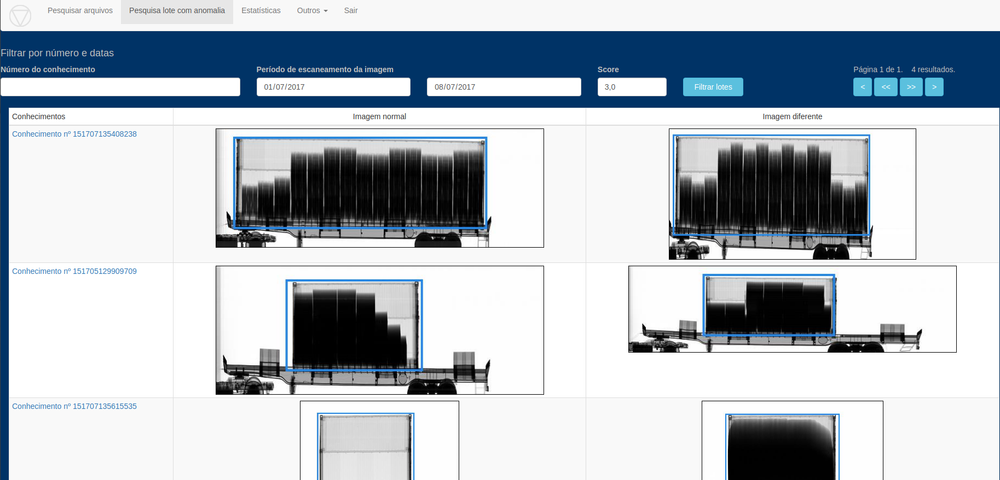
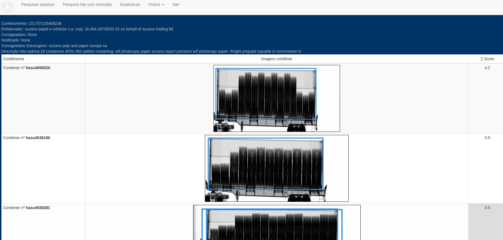

# Concepção

Grande parte das cargas conteinerizadas (?estimar quantos % e colocar??) são compostas de
CEs Mercantes/DIs/DEs com uma grande quantidade de contêineres.

Muitas fraudes podem ser detectadas apenas analisando as imagens de um lote e comparando-as em busca
de uma imagem diferente. Isto pode indicar uma falsa declaração de conteúdo, uma ocultação,
 ou uma manipulação não prevista da Carga (ex. Ripoff). 
 
# Execução

1. Um script detecta os lotes com NCM único no Banco de Dados, recupera todas as imagens, 
extrai um hash e compara todas uma a uma

2. É calculado um zscore do resultado e gravado no Banco de Dados

3. Uma tela no Sistema permite acessar a navegação de vários lotes, filtrando por data e 
zscore, e exibindo as imagens "esperada" e "fora do padrão"

4. Nesta tela é possível clicar para analisar todo o lote em tela específica, ou para analisar o
contêiner

# Publicação

[Pesquisa lote com anomalia](https://ajna.labin.rf08.srf/virasana/lotes_anomalia)  

# Telas

