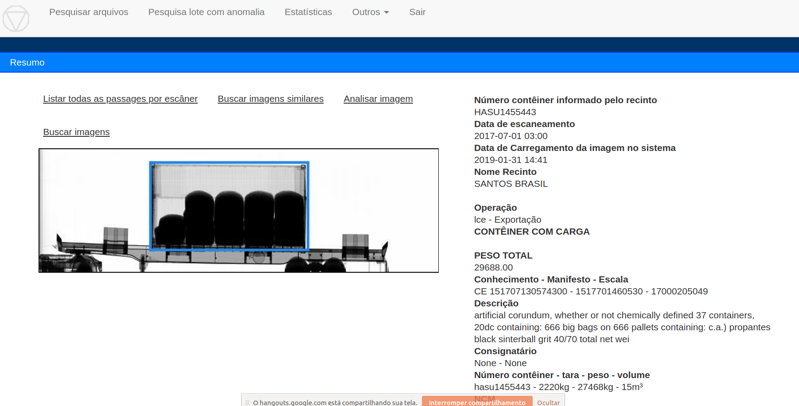

# Concepção

Verificar a existência de imagens similares no Banco de Dados à imagem alvo 
 
# Execução

1. Gerar hash das imagens

2. Carregar na memória um array com todos os hashs

3. Gerar hash da imagem buscada 

4. Retornar tela com lista de imagens ordenado por diferença

# Publicação

[Pesquisa arquivos](https://ajna.labin.rf08.srf/virasana/similar/)  

# Telas

