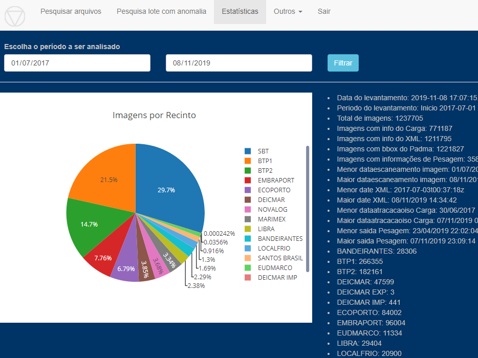
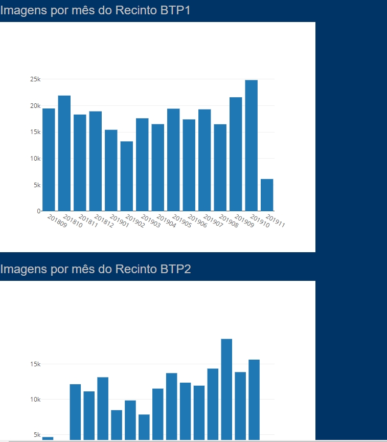

# Concepção

Verificar que as imagens estão sendo carregadas no Servidor, ter uma visão geral
e estatística dos dados carregados, monitorar recintos que não estão transmitindo imagens,
checar se dados de diversas integrações estão disponíveis.
 
Campos da tela
Data do levantamento: Data de pesquisa dos dados exibidos

Periodo do levantamento: Data de início e de fim do filtro dos dados

Total de imagens: Total de imagens do período

Imagens com info do XXXX: Desse total, quantidade que possui informação integrada do sistema XXXX

Menor dataescaneamento imagem: Data de geração da imagem pelos equipamentos de inspeção (menor) 
Maior dataescaneamento imagem: Data de geração da imagem pelos equipamentos de inspeção (maior)

Menor XXXX: Menor data de imagem com dados do sistema XXX

Maior date XML: Maior data de imagem com dados do sistema XXX

# Execução

Selecionar "Estatísticas" no menu superior, inserir o intervalo de datas.
  

# Publicação

[Estatísticas](https://ajna.labin.rf08.srf/virasana/stats)  

# Telas

