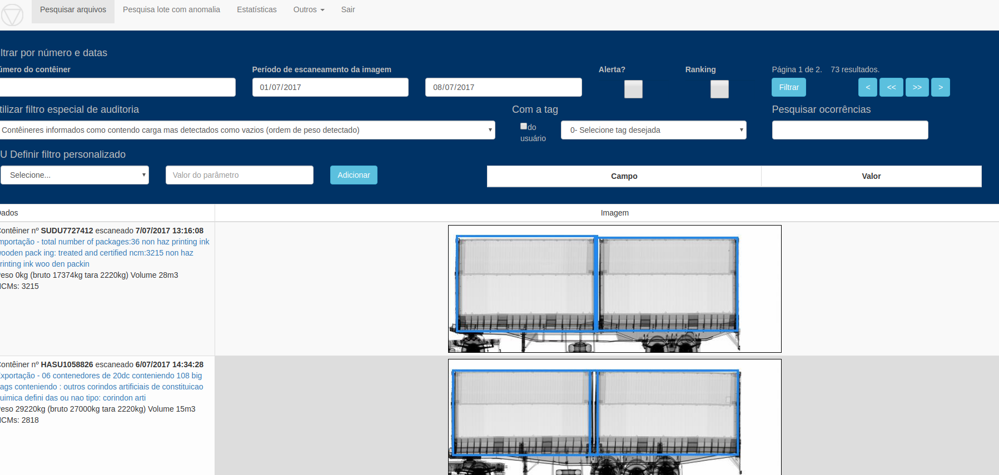

# Concepção

Verificar a existência de contêineres de fato vazios/sem nenhuma carga, sendo declarados como contêineres
 contendo carga (com CE Mercante de exportação ou importação). 
 
# Execução

1. Integrar dados do sistema CARGA com as imagens 

2. Integrar dados do PUCOMEX com as imagens para confirmar informação (em desenvolvimento)

3. Rodar algoritmo de visão computacional para classificar o contêiner em cheio ou vazio

4. Disponibilizar na tela filtro para o Usuário selecionar este cruzamento de dados 

# Publicação

[Pesquisa arquivos](https://ajna.labin.rf08.srf/virasana/files)  

# Telas

