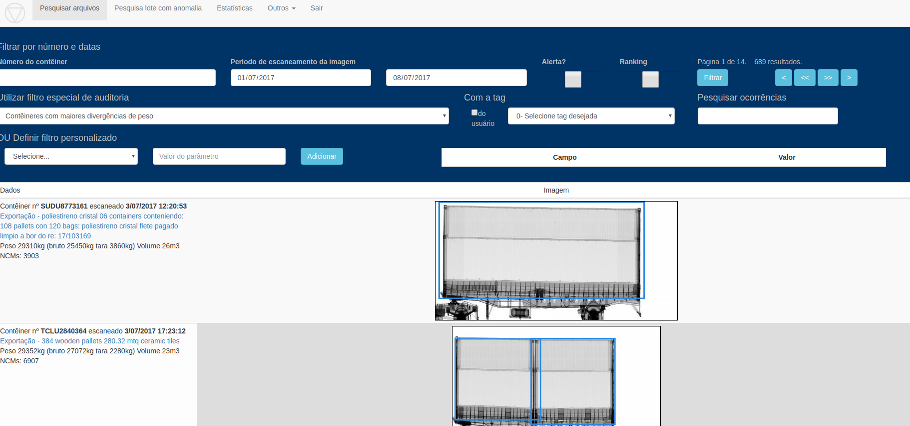
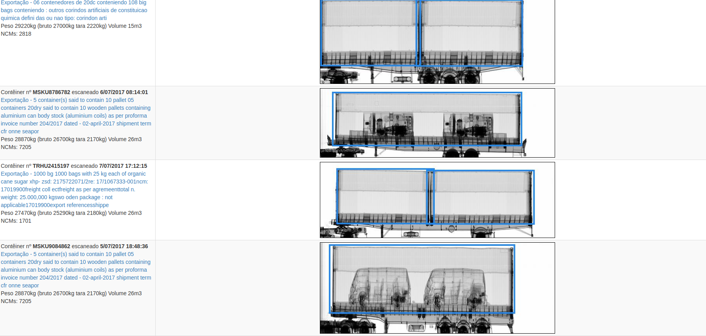
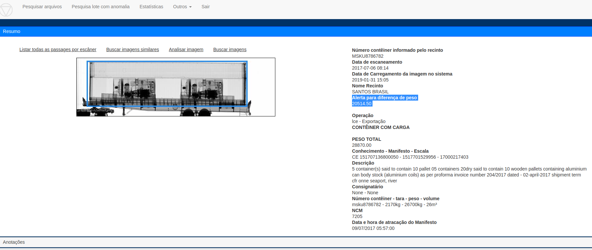

# Concepção

Verificar a existência de contêineres contendo grande quantidade a mais ou menos
 de carga que o declarado(em peso) 
 
# Execução

1. Integrar dados do sistema CARGA com as imagens

2. Integrar dados do PUCOMEX com as imagens para confirmar informação (em desenvolvimento)

3. Integrar dados de pesagem (balança) dos Recintos 

3. Rodar algoritmo de visão computacional para estimar o peso do contêiner

4. Disponibilizar na tela filtro para o Usuário selecionar este cruzamento de dados

Observações:

- O algoritmo de detecção/recorte do contêiner precisa funcionar perfeitamente. No momento EMBRAPORT está 
apresentado problema

- Estão sendo integradas as pesagens dos Recintos de Santos, mas:
    - Só vem informação da importação
    - Falta informação de tara (DTE disponibilizou novo endpoint, precisa ser adaptado) 

# Publicação

[Pesquisa arquivos](https://ajna.labin.rf08.srf/virasana/files)  

# Telas

