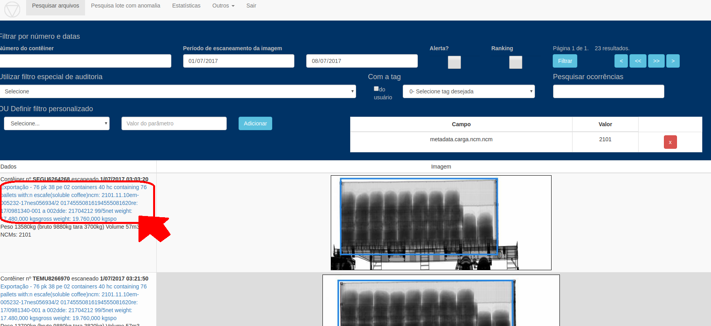
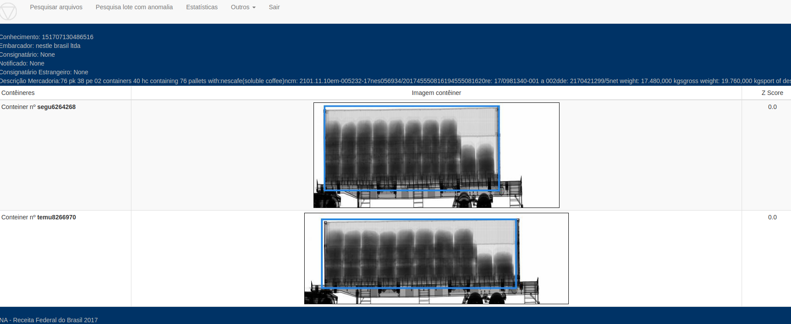

# Concepção

As cargas conteinerizadas são compostas de CEs Mercantes/DIs/DEs com uma grande quantidade de contêineres
com uma frequência grande.

Visualizar todos as imagens de um Lote pode auxiliar a fiscalização.
 
# Execução

1. A tela de pesquisa de imagens permite pesquisar por vários parâmetros

4. Para visualizar o lote, clicar na descrição da mercadoria conforme abaixo

# Publicação

[Pesquisa arquivos](https://ajna.labin.rf08.srf/virasana/files)  

[Visualiza lote](https://ajna.labin.rf08.srf/virasana/cd_mercante)  

# Telas

